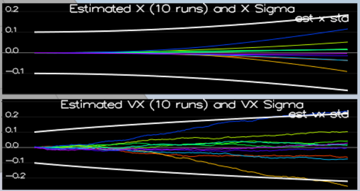

# Estimation Project #

In this project, An EKF (Extended Kalman Filter) is implemented in c++ to handle real world sensor behavior which include noise, inaccuracy, drift, etc.

This README is broken down into the following sections:

 - [Setup](#setup) - the environment and code setup required to get started and a brief overview of the project structure
 - [The Tasks](#the-tasks) - the tasks you will need to complete for the project
 - [Tips and Tricks](#tips-and-tricks) - some additional tips and tricks you may find useful along the way
 - [Submission](#submission) - overview of the requirements for your project submission


## Usage ##

 1. Clone the repository

 2. Import the code into your IDE like done in the [Controls C++ project](https://github.com/udacity/FCND-Controls-CPP#development-environment-setup)
 
 3. Compile and run the estimation simulator


## Implementation ##

### Step 1: Sensor Noise ###

To determine one standard deviation of the signal noise, grab the GPS and accelerometer data from the log files, make sure they have plenty of samples (to reduce sampling error), calculate estimated standard deviation from the samples.

Rounded the numbers to one decimal place.  They turned out to be

```
MeasuredStdDev_GPSPosXY = 0.7
MeasuredStdDev_AccelXY = 0.5
```

The video below shows the standard deviation of ~68% was captured.

<a href="http://www.youtube.com/watch?feature=player_embedded&v=LRq7mXJ3T-4
" target="_blank"></a>

### Step 2: Attitude Estimation ###

To build a better attitude estimator, rate of change in euler angles need to be calculated by transforming gyro readings from body frame to inertial frame.

The implementation in C++ is:

```cpp
  Mat3x3F rot = Mat3x3F::Zeros();
  rot[0] = 1.0;
  rot[1] = sin(rollEst) * tan(pitchEst);
  rot[2] = cos(rollEst) * tan(pitchEst);
  rot[4] = cos(rollEst);
  rot[5] = -sin(rollEst);
  rot[7] = sin(rollEst)/cos(pitchEst);
  rot[8] = cos(rollEst)/cos(pitchEst);

  V3F euler_dot = rot * gyro;
```

The euler angle rate is then multiplied by IMU sampling rate and added to the predicted roll, pitch, and yaw.

Both accelerometer and gyro signals are integrated to provide fast response and non-drifting estimates.

The video below shows the error from the integrated estimates is kept well below 0.1 rad.

<a href="http://www.youtube.com/watch?feature=player_embedded&v=B4dE8gJOkkA
" target="_blank"></a>

### Step 3: Prediction Step ###

In EKF prediction step, the states with Gaussian noises go through nonlinear transform, and the output is no longer Gaussian, so an linearized estimate of the transform is used to keep Gaussian distribution true via the transform.  This is also the heart of EKF.

First, under `PredictState()`, new states estimate prediction is done with discrete integration (delta t):

```cpp
  predictedState[0] = curState[0] + curState[3] * dt;
  predictedState[1] = curState[1] + curState[4] * dt;
  predictedState[2] = curState[2] + curState[5] * dt;

  predictedState[3] = curState[3] + accel_WF.x * dt;
  predictedState[4] = curState[4] + accel_WF.y * dt;
  predictedState[5] = curState[5] + (accel_WF.z - CONST_GRAVITY) * dt;
  predictedState[6] = curState[6];
```

Second, under `GetRbgPrime()`, it returns partial derivative of the rotation matrix.

```cpp
  RbgPrime << -cos(pitch)*sin(yaw), -sin(roll)*sin(pitch)*sin(yaw)-cos(roll)*cos(yaw), -cos(roll)*sin(pitch)*sin(yaw)+sin(roll)*cos(yaw),
            cos(pitch)*cos(yaw), sin(roll)*sin(pitch)*cos(yaw)-cos(roll)*sin(yaw), cos(roll)*sin(pitch)*cos(yaw)+sin(roll)*sin(yaw),
            0.0,0.0,0.0;
```

Finally, under `Predict()`, Jacobian, g prime is implemented:

```cpp
  gPrime(0,3) = dt;
  gPrime(1,4) = dt;
  gPrime(2,5) = dt;
  gPrime(3,6) = (RbgPrime(0,0) * accel[0] + RbgPrime(0,1) * accel[1] + RbgPrime(0,2) * accel[2]) * dt;
  gPrime(4,6) = (RbgPrime(1,0) * accel[0] + RbgPrime(1,1) * accel[1] + RbgPrime(1,2) * accel[2]) * dt;
  gPrime(5,6) = (RbgPrime(2,0) * accel[0] + RbgPrime(2,1) * accel[1] + RbgPrime(2,2) * accel[2]) * dt;
```

G prime is then used to calculate predicted covariance matrix.

The implementation is simply:

```cpp
ekfCov = gPrime * ekfCov * gPrime.transpose() + Q;
```

In the video below, it shows the positions/velocities x and y are predicted very well, but not vertical position/velocity.  This is because there is only accelerometer (drift prone) as sensor input so far.

<a href="http://www.youtube.com/watch?feature=player_embedded&v=10D98LYQYkw
" target="_blank"></a>

To tune covariance prediction, the following parameters are used:

```cpp
QPosXYStd = .04
QVelXYStd = .2
```

With the tuned parameters shown above, the prediction (white curves below) grows at the same pace as the data (rest of the curves).




### Step 4: Magnetometer Update ###

Magnetometers can be used to update yaw angle of the flying vehicle.  Magnetometers are not high resolutions or accuracy, but they are not prone to drift, which are useful for long term.
Yaw signal noise standard deviation is tuned by sampling the signals and calculate for estimated standard deviation.  The tuned value is listed below:

```cpp
QYawStd = .11
```

The code implementation requires the lower difference between estimated and measured yaw angles, so a few lines of code will corrected the estimated yaw based on the measured yaw.

```cpp
  if (magYaw - zFromX(0) > F_PI) {
	zFromX(0) += 2.0 * F_PI;
  }
  else if (magYaw - zFromX(0) < -F_PI){
	zFromX(0) -= 2.0 * F_PI;
  }
```

The video below shows the implementation result.  The yaw error is kept below +/-0.1 rad for the duration of the test, and `QYawStd` captures ~68% of the data, which is one standard deviation.

<a href="http://www.youtube.com/watch?feature=player_embedded&v=XqBj6MmyDnU
" target="_blank"></a>

### Step 5: Closed Loop + GPS Update ###

To implement estimator with realistic IMU sensors activated, the GPS uncertainty is tuned as below:

```cpp
GPSPosXYStd = 1
GPSPosZStd = 5
GPSVelXYStd = .1
GPSVelZStd = .6
```

For the actual `UpdateFromGPS()` implementation, it is as simple as using prdicted states and h prime.

Actual implementation is:

```cpp
  for ( int i = 0; i < 6; i++) {
	  zFromX(i) = ekfState(i);
  }
  
  for ( int i = 0; i < 6; i++) {
    hPrime(i,i) = 1;
  }
```

The video below shows a working and stable quadrotor control.  The z position error is withint 1.0m.

<a href="http://www.youtube.com/watch?feature=player_embedded&v=3zOdd6qcK68
" target="_blank"></a>

### Step 6: Adding Your Controller ###

With `QuadController.cpp` replaced, `QuadControlParams.txt` is retuned to ensure stability of the quadrotor.

The video above in Step 5 included retuned parameters.

```cpp
# Position control gains
kpPosXY = 2.2
kpPosZ = 2.2
KiPosZ = 50

# Velocity control gains
kpVelXY = 11
kpVelZ = 11

# Angle control gains
kpBank = 12
kpYaw = 3

# Angle rate gains
kpPQR = 70, 70, 15
```
